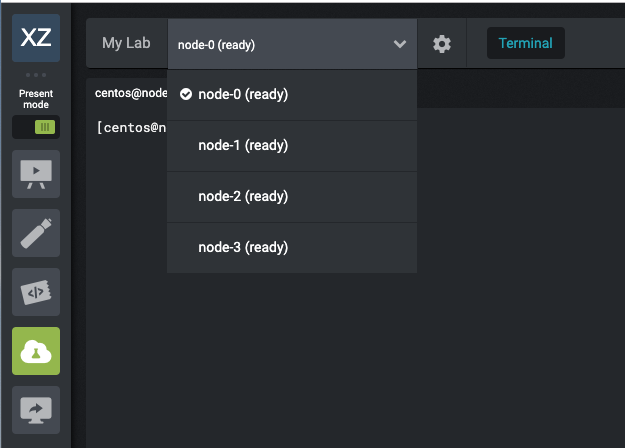
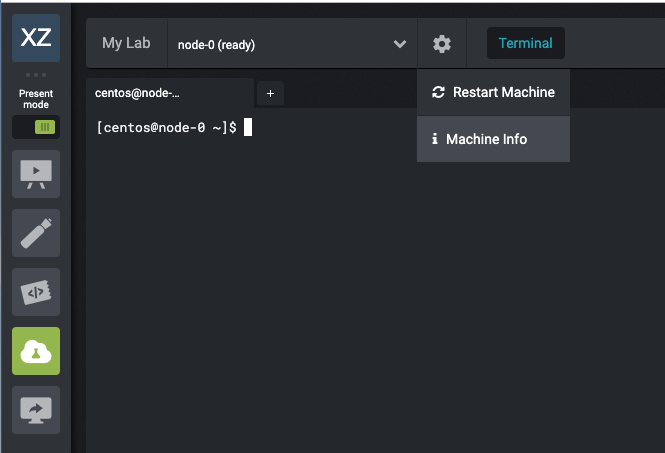
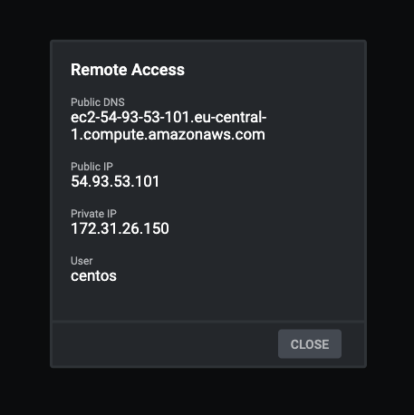
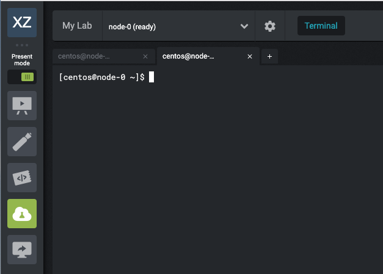

# Introduction to Strigo

With this introduction to Strigo, you should know how to:

 - Use the dropdown to switch nodes
 - Use the gear button to find out IP/public DNS info
 - Use the tabbing mechanism to make new session tabs
 - Perform some basic troubleshooting of your Strigo environment

## Switch Nodes

1.  Using the drop down menu near the top of the page will allow you to switch nodes:

    /

    **At the start of your workshop, it's a good idea to check your connection to all your nodes.** If any of them are unresponsive, your instructor can replace them through the student admin panel.

## Connection Information

1.  To the right of the drop down menu, there is a gear symbol. Click on it then on the `Machine Info` tab in order to get information about this node:

    /

    Something like this will pop up:

    /

## Creating New Sessions

1.  In some exercises, you will need to have a second connection session for one node. To create another connection session, you will need to click on the `+` button to the right of the current opened tab:

    /

    You will now see two tabs connected to the same node:

    /

    You can make more if necessary.

## Troubleshooting

### Cutting and Pasting

Some users on some platfoms report trouble cutting and pasting between documents on their machine and Strigo. If you're having trouble, see the edge-case workarounds below:

 - **Windows machine, linux VMs in Strigo**: if you're accessing linux VMs in Strigo from a Windows machine, try the latest Firefox rather than Chrome.
 - **Windows VMs in Strigo**: Note that the Strigo environment is a full remote desktop. Try opening a browser _inside_ your Strigo environment, and visiting the exercies website from there; users report more success cutting and pasting between browsers and powershells inside the same VM, rather than from a browser on their machine to a powershell inside the Windows VM.
 
### Direct SSH

All Strigo nodes are set up with a keypair so you can SSH directly to them if your network allows, rather than using the in-browser terminal. To connect:

 - Look for the private key named `$HOSTNAME_rsa` in the home directory of each node.
 - Copy this to your local machine, and restrict its permissions:
 
 ```
 $ chmod 400 hostname_rsa
 ```
 - connect to your node (check command line in the Strigo browser for user, might be `ubuntu` or `centos` depending on lab):
 ```
 $ ssh -i hostname_rsa ubuntu@<public IP>
 ```
 
### Node Failure (instructors)

Note that if a student experiences a failure in their VMs, an instructor can replace all of them by visiting the Student list in the Strigo instructor's environment, checking the checkbox by the student's name, and choosing *Replace Nodes*. Note that this destroys and replaces the existing VMs for that student, so should only be used as a last resort.

### Extra Lab Time (instructors)

If you need more time for your class, navigate to the settings page (cog in the bottom left of the instructor view), and click *Extend*. Feel free to give your students one extra day after the class ends to finish exercises they didn't have time for during the workshop.
